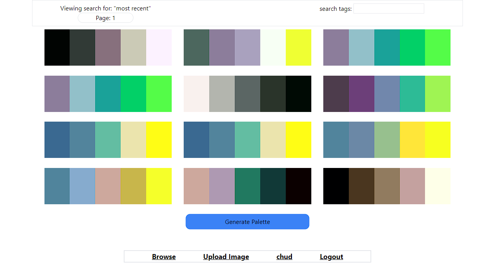

# Pretty Palettes

Foobar is a Python library for dealing with word pluralization.

## Usage

A live demo can be found [here](https://pretty-palettes.onrender.com/home).

### Homepage
Here you can generate a new palette at random or save colors you like and a palette will generate in regards to selected colors.

### Your page
Store all of your saved palettes and create collections.

### Community
Browse what others have been saving. Search for a particular "tag".

### Upload Image
Upload an image and receive that images' palette. 

## Tech

 

## Shoutouts

Big thank you to the team at [Huemint](https://huemint.com/about/). Huemint is the API that generates the palette. I am simply making a call to that API with any use preferences, such as what colors they'd like to iterate on. 

